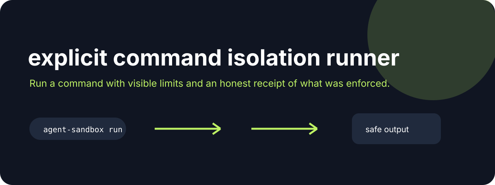

# Agent Sandbox Run



**Run a command with visible limits and an honest receipt of what was enforced.**

[](https://github.com/jonah-ux/agent-sandbox-run/actions/workflows/ci.yml)
[](https://www.python.org/)
[](LICENSE)

Agent Sandbox Run executes a command and emits a JSON receipt showing the exit code, duration,
stdout, timeout behavior, command and output digests, bounded output state, and whether bubblewrap
was actually available as the backend. The fallback is intentionally visible instead of being
described as isolation.

The receipt also separates backend discovery from backend proof: `backend_detected` means a
`bwrap` executable was found, `backend_attempted` means its boundary probe ran, `enforced` means
the probe succeeded and the command used that boundary, and `backend_failed` plus
`backend_failure_reason` explain a clean downgrade to fallback. The probe runs a harmless
`/bin/true` inside the same read-only/no-network shape before the requested command. Every command
starts a new process session; a timeout kills that entire process group before the receipt is
emitted.

## Try it in 30 seconds

```bash
git clone --branch v0.2.0 --depth 1 https://github.com/jonah-ux/agent-sandbox-run.git
cd agent-sandbox-run
python3 -m venv .venv
. .venv/bin/activate
python -m pip install .
python demos/demo.py
```

Run a bounded command and inspect the receipt:

```bash
agent-sandbox run --timeout 5 --max-output 4096 /bin/echo hello
```

## Capability walkthrough

Open the [standalone capability walkthrough](docs/walkthrough.html) for a visual, synthetic receipt and backend matrix. It does not inspect your machine or require Agent Policy, Agent Proof, or any other sibling repository.

## See it work

The receipt names the backend and whether isolation was actually enforced:

```json
{"schema":"agent-sandbox/v2","ok":true,"backend":"fallback","enforced":false,"backend_detected":false,"backend_attempted":false,"backend_failed":false,"exit_code":0,"timed_out":false,"stdout":"hello from the sandbox\n","stdout_sha256":"...","receipt_sha256":"..."}
```

## Related tools

Use [Agent Policy](https://github.com/jonah-ux/agent-policy) before deciding whether a command may run, [Agent Proof](https://github.com/jonah-ux/agent-proof) to archive the receipt, and [MCP Doctor](https://github.com/jonah-ux/mcp-doctor) to inspect the tools an agent can call.

Look for `backend`, `enforced`, `exit_code`, `timed_out`, `command_sha256`, `stdout_sha256`,
`stdout_truncated`, and `receipt_sha256` in the `agent-sandbox/v2` result. A fallback execution is
still useful evidence, but it is not isolation.

## Development

```bash
python -m unittest discover -s tests
python -m build --sdist --wheel
python demos/demo.py
```

Read [SECURITY.md](SECURITY.md) before using this around untrusted commands. Treat the receipt
as an observation of this process, not a system security guarantee.

## Public surface audit

Run the owner-native supply-chain and privacy audit from a clean checkout:

```console
python scripts/audit_public_surface.py --json
```

The static receipt checks the dependency and license declarations, release-workflow provenance
markers, and high-signal secret patterns across tracked text files. Pass a built `dist/` directory
with `--dist-dir dist` to compare wheel and sdist bytes with `SHA256SUMS`. Missing artifacts remain
`unavailable`; a passing audit does not claim security, deployment, adoption, or production
readiness.

MIT licensed.
